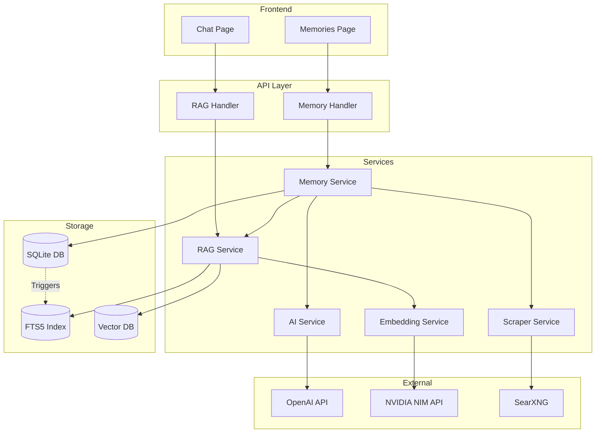
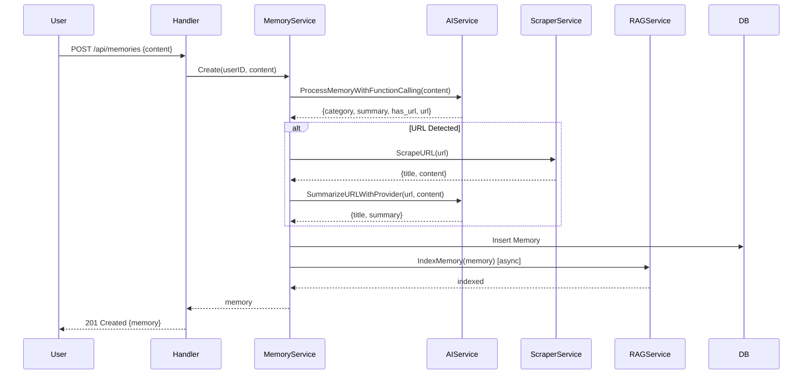
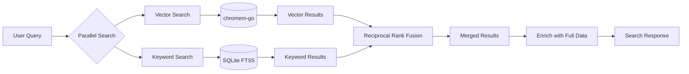
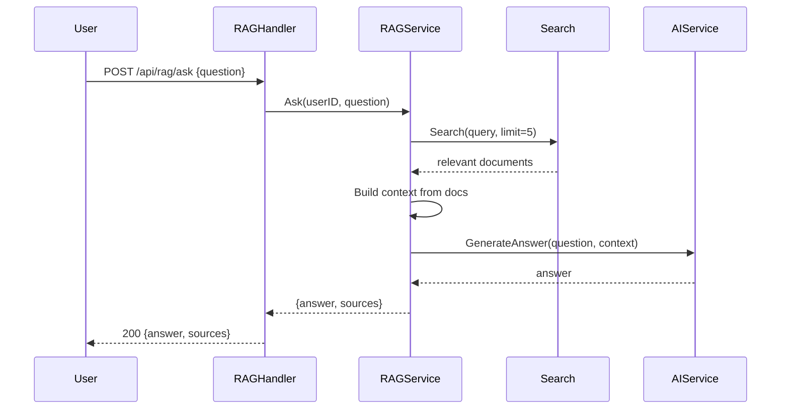

# RAG & Memories System Documentation

**Document Version**: 2.0  
**Last Updated**: 2025-12-31  
**Status**: Reference Documentation  
**Embedding Provider**: NVIDIA NIM (nv-embedqa-e5-v5)

---

## Table of Contents

1. [Overview](#overview)
2. [System Architecture](#system-architecture)
3. [Memories System](#memories-system)
4. [RAG (Retrieval-Augmented Generation)](#rag-retrieval-augmented-generation)
5. [Vector Storage](#vector-storage)
6. [Full-Text Search](#full-text-search)
7. [AI Provider Integration](#ai-provider-integration)
8. [API Reference](#api-reference)
9. [Frontend Integration](#frontend-integration)
10. [Configuration](#configuration)

---

## Overview

The RAG & Memories system provides intelligent knowledge management capabilities for the todomyday application. It allows users to:

- **Capture memories**: Store notes, ideas, links, and thoughts with automatic AI categorization
- **Search semantically**: Find information using natural language queries across todos and memories
- **Ask questions**: Get AI-generated answers based on stored personal data
- **Extract URL content**: Automatically scrape and summarize linked web pages
- **Generate digests**: Create weekly summaries of captured memories

### Key Features

| Feature | Description |
|---------|-------------|
| Hybrid Search | Combines vector similarity + keyword matching for best results |
| AI Categorization | Automatic classification into 11 categories |
| URL Processing | Scrapes and summarizes web pages mentioned in memories |
| File Upload | Import memories from .txt and .md files |
| Weekly Digest | AI-generated summary of the week's memories |
| Q&A System | Ask natural language questions about your data |

---

## System Architecture

### High-Level Architecture



### Component Responsibilities

| Component | File | Responsibility |
|-----------|------|----------------|
| `MemoryService` | `services/memory_service.go` | Memory CRUD, AI processing, digest generation |
| `RAGService` | `services/rag_service.go` | Hybrid search, Q&A, indexing |
| `EmbeddingService` | `services/embedding_service.go` | Generate text embeddings via NVIDIA NIM |
| `TokenCounter` | `services/token_counter.go` | BERT-style token counting for NIM |
| `DocumentChunker` | `services/document_chunker.go` | Token-aware text chunking and sanitization |
| `AIService` | `services/ai_service.go` | AI processing, function calling |
| `ScraperService` | `services/scraper_service.go` | URL scraping, web search |
| `VectorRepository` | `repository/vector_repository.go` | Vector storage with chromem-go |
| `FTSRepository` | `repository/fts_repository.go` | SQLite FTS5 keyword search |
| `MemoryRepository` | `repository/memory_repository.go` | Memory database operations |

---

## Memories System

### Memory Model

A memory represents a piece of captured information with AI-enhanced metadata.

```go
type Memory struct {
    ID         string    `json:"id"`
    UserID     string    `json:"user_id"`
    Content    string    `json:"content"`      // Original user input
    Summary    *string   `json:"summary"`      // AI-generated summary
    Category   string    `json:"category"`     // AI-assigned category
    URL        *string   `json:"url"`          // Detected URL
    URLTitle   *string   `json:"url_title"`    // Scraped page title
    URLContent *string   `json:"url_content"`  // AI summary of URL content
    IsArchived bool      `json:"is_archived"`
    CreatedAt  time.Time `json:"created_at"`
    UpdatedAt  time.Time `json:"updated_at"`
}
```

### Categories

Memories are automatically classified into one of 11 categories:

| Category | Description | Example |
|----------|-------------|---------|
| Websites | Links, tools, apps, online resources | "Check out this cool tool: https://..." |
| Food | Restaurants, recipes, dishes, drinks | "Great pizza at Mario's on Main St" |
| Movies | Films, TV shows, videos | "Need to watch Inception" |
| Books | Books, articles, reading material | "Reading 'Atomic Habits'" |
| Ideas | Thoughts, concepts, project ideas | "What if we built an app that..." |
| Places | Locations, travel destinations, venues | "Coffee shop on 5th Ave is nice" |
| Products | Items to buy, gadgets, purchases | "Looking for a new keyboard" |
| People | Contacts, people met, networking | "Met John at the conference" |
| Learnings | Lessons learned, TIL, insights | "TIL that TypeScript..." |
| Quotes | Memorable phrases, sayings | "'The only way to do great work...'" |
| Uncategorized | Default if nothing else fits | Any unclassified content |

### Memory Creation Flow



### AI Function Calling for Memory Processing

The system uses OpenAI-compatible function calling to process memories in a structured way:

```go
var memoryProcessingTools = []Tool{
    {
        Type: "function",
        Function: ToolFunction{
            Name:        "categorize_memory",
            Description: "Analyze and categorize a memory/note",
            Parameters: map[string]interface{}{
                "type": "object",
                "properties": map[string]interface{}{
                    "summary": map[string]interface{}{
                        "type":        "string",
                        "description": "Brief 1-sentence summary",
                    },
                    "category": map[string]interface{}{
                        "type": "string",
                        "enum": []string{
                            "Websites", "Food", "Movies", "Books", "Ideas",
                            "Places", "Products", "People", "Learnings", 
                            "Quotes", "Uncategorized",
                        },
                    },
                    "has_url": map[string]interface{}{
                        "type":        "boolean",
                        "description": "Whether content contains a URL",
                    },
                    "url": map[string]interface{}{
                        "type":        "string",
                        "description": "The URL found in content",
                    },
                },
                "required": []string{"category"},
            },
        },
    },
    {
        Type: "function",
        Function: ToolFunction{
            Name:        "web_search",
            Description: "Search the web when user wants to research something",
            Parameters: map[string]interface{}{
                "type": "object",
                "properties": map[string]interface{}{
                    "query": map[string]interface{}{
                        "type":        "string",
                        "description": "The search query",
                    },
                    "category": map[string]interface{}{
                        "type": "string",
                        "enum": []string{...},
                    },
                },
                "required": []string{"query", "category"},
            },
        },
    },
}
```

### File Upload

Users can upload `.txt` or `.md` files to bulk-create memories:

| File Type | Behavior |
|-----------|----------|
| `.txt` | Entire file becomes one memory |
| `.md` | Split by `#` and `##` headings into multiple memories |

```go
// FileParserService handles parsing
func (s *FileParserService) ParseFile(filename string, content []byte) ([]ParsedMemorySection, error) {
    fileType, err := s.GetFileType(filename)
    switch fileType {
    case ".txt":
        return s.parseTxtFile(filename, content)
    case ".md":
        return s.parseMarkdownFile(filename, content)
    }
}
```

**Limits:**
- Maximum file size: 5 MB
- Allowed types: `.txt`, `.md`

### Weekly Digest

Generate an AI-powered summary of the week's memories:

```go
func (s *MemoryService) GetOrGenerateDigest(userID string, forceRegenerate bool) (*models.MemoryDigest, error) {
    // Calculate week start (Sunday)
    weekStart := calculateWeekStart(time.Now())
    weekEnd := weekStart.AddDate(0, 0, 6)
    
    // Get memories from this week
    memories, _ := s.memoryRepo.GetByDateRange(userID, weekStart, weekEnd)
    
    // Generate digest with AI
    digestContent, _ := GenerateWeeklyDigestWithProvider(memories, config)
    
    // Save and return
    return digest, nil
}
```

---

## RAG (Retrieval-Augmented Generation)

### Hybrid Search Architecture

The RAG system combines two search methods for optimal results:



### Search Request

```go
type SearchRequest struct {
    Query        string   `json:"query" binding:"required"`
    ContentTypes []string `json:"content_types"` // ["todo", "memory"]
    Limit        int      `json:"limit"`         // Default: 10
    VectorWeight float64  `json:"vector_weight"` // Default: 0.7
}
```

### Reciprocal Rank Fusion (RRF)

RRF combines results from vector and keyword search using position-based scoring:

```go
func (s *RAGService) reciprocalRankFusion(
    vectorResults, keywordResults []models.SearchResult, 
    vectorWeight float64,
) []models.SearchResult {
    const k = 60.0 // RRF constant
    
    scoreMap := make(map[string]float64)
    
    // Score vector results
    for i, result := range vectorResults {
        key := fmt.Sprintf("%s-%s", result.Document.ContentType, result.Document.ContentID)
        rrf := vectorWeight * (1.0 / (k + float64(i+1)))
        scoreMap[key] += rrf
    }
    
    // Score keyword results
    keywordWeight := 1.0 - vectorWeight
    for i, result := range keywordResults {
        key := fmt.Sprintf("%s-%s", result.Document.ContentType, result.Document.ContentID)
        rrf := keywordWeight * (1.0 / (k + float64(i+1)))
        scoreMap[key] += rrf
    }
    
    // Sort by combined score
    return sortedResults
}
```

**Formula:** `RRF Score = Σ(weight / (k + rank))`

Where:
- `weight` = 0.7 for vector, 0.3 for keyword (configurable)
- `k` = 60 (constant)
- `rank` = position in result list (1-based)

### Q&A (Ask) Flow



### Context Building for Q&A

```go
func (s *RAGService) Ask(ctx context.Context, userID string, req *models.AskRequest) (*models.AskResponse, error) {
    // 1. Search for relevant documents
    searchResp, _ := s.Search(ctx, userID, &models.SearchRequest{
        Query:        req.Question,
        ContentTypes: req.ContentTypes,
        Limit:        req.MaxContext, // Default: 5
        VectorWeight: 0.7,
    })
    
    // 2. Build context string from results
    contextParts := []string{}
    for i, result := range searchResp.Results {
        switch result.Document.ContentType {
        case models.ContentTypeTodo:
            contextItem = fmt.Sprintf("[Todo %d] %s\n  Status: %s", 
                i+1, result.Document.Title, status)
        case models.ContentTypeMemory:
            contextItem = fmt.Sprintf("[Memory %d] %s\n  Category: %s", 
                i+1, result.Document.Content, category)
        }
        contextParts = append(contextParts, contextItem)
    }
    
    // 3. Generate answer using AI
    answer, _ := s.generateAnswer(ctx, userID, req.Question, contextStr)
    
    return &models.AskResponse{
        Answer:  answer,
        Sources: searchResp.Results,
    }, nil
}
```

### Indexing

Documents (todos and memories) are indexed automatically when created/updated:

```go
// Async indexing in MemoryService.Create()
if s.ragService != nil && s.ragService.IsConfigured() {
    go func(m *models.Memory) {
        ctx, cancel := context.WithTimeout(context.Background(), 10*time.Second)
        defer cancel()
        s.ragService.IndexMemory(ctx, m)
    }(memory)
}
```

**Manual bulk indexing:**

```go
func (s *RAGService) IndexAllForUser(ctx context.Context, userID string) (*models.IndexResponse, error) {
    // Index all todos
    todos, _ := s.todoRepo.GetAllByUserID(userID)
    for _, todo := range todos {
        if s.vectorRepo.GetByContentID(models.ContentTypeTodo, todo.ID) == nil {
            doc := s.todoToDocument(&todo)
            s.vectorRepo.Add(ctx, doc)
        }
    }
    
    // Index all memories
    memories, _ := s.memoryRepo.GetAllByUserID(userID, 1000, 0)
    for _, memory := range memories {
        if s.vectorRepo.GetByContentID(models.ContentTypeMemory, memory.ID) == nil {
            doc := s.memoryToDocument(&memory)
            s.vectorRepo.Add(ctx, doc)
        }
    }
    
    return &models.IndexResponse{Indexed: indexed, Skipped: skipped}
}
```

---

## Vector Storage

### chromem-go

The system uses [chromem-go](https://github.com/philippgille/chromem-go) as an embedded vector database.

**Features:**
- Pure Go implementation (no external dependencies)
- Persistent storage to disk
- Thread-safe with RWMutex
- Metadata filtering
- Cosine similarity search

### Document Model

```go
type Document struct {
    ID          string            `json:"id"`
    ContentType ContentType       `json:"content_type"` // "todo" or "memory"
    ContentID   string            `json:"content_id"`   // Original entity ID
    UserID      string            `json:"user_id"`
    Title       string            `json:"title"`
    Content     string            `json:"content"`
    Metadata    map[string]string `json:"metadata"`
    Embedding   []float32         `json:"embedding,omitempty"`
    CreatedAt   time.Time         `json:"created_at"`
}
```

### Embedding Generation

Embeddings are generated using NVIDIA NIM's API with the `nv-embedqa-e5-v5` model:

```go
type EmbeddingService struct {
    baseURL     string        // https://integrate.api.nvidia.com/v1
    apiKey      string
    model       string        // nvidia/nv-embedqa-e5-v5
    dimension   int           // 1024
    minInterval time.Duration // Rate limiting (40 RPM)
}

// EmbedPassage generates embeddings for documents (indexing)
func (s *EmbeddingService) EmbedPassage(ctx context.Context, text string) ([]float32, error) {
    return s.EmbedWithType(ctx, text, InputTypePassage)
}

// EmbedQuery generates embeddings for search queries
func (s *EmbeddingService) EmbedQuery(ctx context.Context, text string) ([]float32, error) {
    return s.EmbedWithType(ctx, text, InputTypeQuery)
}

func (s *EmbeddingService) EmbedWithType(ctx context.Context, text string, inputType InputType) ([]float32, error) {
    // Sanitize text (unicode normalization, special char replacement)
    text = SanitizeText(text)
    
    // Truncate to 1800 chars (NIM's 512 token limit)
    text = TruncateForEmbedding(text)
    
    // Rate limiting (40 RPM)
    s.rateLimit()
    
    // Call NIM API with input_type
    reqBody := nimEmbeddingRequest{
        Model:          s.model,
        Input:          text,
        InputType:      string(inputType), // "passage" or "query"
        EncodingFormat: "float",
    }
    // POST to {baseURL}/embeddings
    return embedding, nil
}
```

**Key Features:**
- **Dual Input Types**: Uses "passage" for document indexing, "query" for search queries
- **Rate Limiting**: Enforces 40 requests per minute (1.5s minimum interval)
- **Text Sanitization**: Unicode normalization, Greek letters, math symbols, special chars
- **Token-Aware Truncation**: 1800 char limit (~512 tokens)

**Embedding Dimensions:**
| Model | Dimensions |
|-------|------------|
| `nvidia/nv-embedqa-e5-v5` | 1024 |
| `text-embedding-3-small` (OpenAI) | 1536 |
| `text-embedding-3-large` (OpenAI) | 3072 |

### Content Preparation

Documents are prepared for embedding by combining multiple fields:

```go
func prepareContentForEmbedding(doc *models.Document) string {
    var parts []string
    
    if doc.Title != "" {
        parts = append(parts, doc.Title)
    }
    if doc.Content != "" {
        parts = append(parts, doc.Content)
    }
    if category, ok := doc.Metadata["category"]; ok && category != "" {
        parts = append(parts, "Category: "+category)
    }
    if tags, ok := doc.Metadata["tags"]; ok && tags != "" {
        parts = append(parts, "Tags: "+tags)
    }
    
    return strings.Join(parts, "\n")
}
```

### Storage Location

Vector data is persisted to: `./data/vectors/`

```go
func NewVectorRepository(cfg VectorConfig, embeddingSvc EmbeddingService) (*VectorRepository, error) {
    if cfg.PersistPath != "" {
        db, err = chromem.NewPersistentDB(cfg.PersistPath, false)
    } else {
        db = chromem.NewDB() // In-memory
    }
    
    // Embedding function uses EmbedPassage for document indexing
    embeddingFn := func(ctx context.Context, text string) ([]float32, error) {
        return embeddingSvc.EmbedPassage(ctx, text)
    }
    
    collection, _ := db.GetOrCreateCollection("documents", nil, embeddingFn)
    return &VectorRepository{db: db, collection: collection, embeddingSvc: embeddingSvc}, nil
}

// Search uses EmbedQuery for query-optimized embeddings
func (r *VectorRepository) Search(ctx context.Context, query string, limit int, filters map[string]string) ([]models.SearchResult, error) {
    queryEmbedding, _ := r.embeddingSvc.EmbedQuery(ctx, query)
    results, _ := r.collection.QueryEmbedding(ctx, queryEmbedding, limit, filters, nil)
    // ...
}
```

**Note:** NIM uses separate embedding types for optimal retrieval:
- `EmbedPassage()` - Optimized for document content (used during indexing)
- `EmbedQuery()` - Optimized for search queries (used during search)
```

---

## Full-Text Search

### SQLite FTS5

The system uses SQLite's FTS5 (Full-Text Search 5) extension for keyword-based search.

### Schema

```sql
CREATE VIRTUAL TABLE content_fts USING fts5(
    content_id,
    content_type,
    user_id UNINDEXED,  -- Not searchable, just for filtering
    title,
    content,
    tags,
    category,
    tokenize='porter unicode61'  -- Porter stemming + Unicode support
);
```

### Auto-Sync Triggers

FTS5 stays synchronized with the main tables via SQLite triggers:

```sql
-- Todos triggers
CREATE TRIGGER todos_ai AFTER INSERT ON todos BEGIN
    INSERT INTO content_fts(content_id, content_type, user_id, title, content, tags, category)
    VALUES (NEW.id, 'todo', NEW.user_id, NEW.title, COALESCE(NEW.description, ''), NEW.tags, '');
END;

CREATE TRIGGER todos_ad AFTER DELETE ON todos BEGIN
    DELETE FROM content_fts WHERE content_id = OLD.id AND content_type = 'todo';
END;

CREATE TRIGGER todos_au AFTER UPDATE ON todos BEGIN
    DELETE FROM content_fts WHERE content_id = OLD.id AND content_type = 'todo';
    INSERT INTO content_fts(...)
    VALUES (NEW.id, 'todo', NEW.user_id, NEW.title, COALESCE(NEW.description, ''), NEW.tags, '');
END;

-- Memories triggers (similar pattern)
CREATE TRIGGER memories_ai AFTER INSERT ON memories BEGIN
    INSERT INTO content_fts(content_id, content_type, user_id, title, content, tags, category)
    VALUES (NEW.id, 'memory', NEW.user_id, COALESCE(NEW.url_title, ''), NEW.content, '', NEW.category);
END;
```

### Search with Highlights

```go
func (r *FTSRepository) Search(userID, query string, contentTypes []string, limit int) ([]FTSResult, error) {
    ftsQuery := prepareFTSQuery(query) // Add prefix matching: "word" -> "word*"
    
    sqlQuery := `
        SELECT
            content_id,
            content_type,
            user_id,
            title,
            content,
            tags,
            category,
            rank,
            snippet(content_fts, 3, '<mark>', '</mark>', '...', 32) as snippet
        FROM content_fts
        WHERE content_fts MATCH ? AND user_id = ?
        ORDER BY rank
        LIMIT ?
    `
    
    rows, _ := r.db.Query(sqlQuery, ftsQuery, userID, limit)
    // ...
}
```

### Query Preparation

```go
func prepareFTSQuery(query string) string {
    words := strings.Fields(query)
    var parts []string
    for _, word := range words {
        // Remove FTS5 special characters
        cleaned := removeSpecialChars(word)
        if cleaned != "" {
            parts = append(parts, cleaned+"*") // Prefix matching
        }
    }
    return strings.Join(parts, " ")
}
```

---

## AI Provider Integration

### Supported Providers

| Provider | Type | Base URL |
|----------|------|----------|
| OpenAI | `openai` | `https://api.openai.com/v1` |
| Anthropic | `anthropic` | `https://api.anthropic.com/v1` |
| Google | `google` | `https://generativelanguage.googleapis.com/v1beta` |
| Custom | `custom` | Any OpenAI-compatible endpoint |

### Provider Configuration

```go
type AIProviderConfig struct {
    ProviderType models.ProviderType
    BaseURL      string
    APIKey       string
    Model        string
}
```

### Provider Selection

The system tries user-configured providers first, then falls back to environment defaults:

```go
func (s *MemoryService) getAIConfig(userID string) *AIProviderConfig {
    // Try user's configured provider
    if s.aiProviderService != nil {
        provider, _ := s.aiProviderService.GetDefaultByUserID(userID)
        if provider != nil && provider.SelectedModel != nil {
            apiKey, _ := s.aiProviderService.GetDecryptedAPIKey(provider)
            return &AIProviderConfig{
                ProviderType: provider.ProviderType,
                BaseURL:      provider.BaseURL,
                APIKey:       apiKey,
                Model:        *provider.SelectedModel,
            }
        }
    }
    
    // Fall back to default AI service (from env)
    if s.aiService != nil && s.aiService.IsConfigured() {
        return &AIProviderConfig{
            ProviderType: models.ProviderTypeOpenAI,
            BaseURL:      s.aiService.baseURL,
            APIKey:       s.aiService.apiKey,
            Model:        s.aiService.model,
        }
    }
    
    return nil
}
```

### Provider-Specific API Calls

```go
func callOpenAICompatible(config *AIProviderConfig, prompt string) (string, error) {
    reqBody := chatRequest{
        Model:       config.Model,
        Messages:    []chatMessage{{Role: "user", Content: prompt}},
        MaxTokens:   500,
        Temperature: 0.3,
    }
    // POST to {baseURL}/chat/completions
}

func callAnthropic(config *AIProviderConfig, prompt string) (string, error) {
    reqBody := anthropicRequest{
        Model:     config.Model,
        MaxTokens: 200,
        Messages:  []anthropicMessage{{Role: "user", Content: prompt}},
    }
    // POST to {baseURL}/messages with x-api-key header
}

func callGoogle(config *AIProviderConfig, prompt string) (string, error) {
    reqBody := googleRequest{
        Contents: []googleContent{{Parts: []googlePart{{Text: prompt}}}},
        GenerationConfig: googleGenConfig{MaxOutputTokens: 200, Temperature: 0.3},
    }
    // POST to {baseURL}/models/{model}:generateContent?key={apiKey}
}
```

---

## API Reference

### Memory Endpoints

#### Get All Memories

```http
GET /api/memories?limit=50&offset=0
Authorization: Bearer <token>
```

**Response:**
```json
{
  "memories": [
    {
      "id": "uuid",
      "user_id": "uuid",
      "content": "Great coffee at Blue Bottle",
      "summary": "Coffee shop recommendation",
      "category": "Food",
      "url": null,
      "url_title": null,
      "url_content": null,
      "is_archived": false,
      "created_at": "2025-12-31T10:00:00Z",
      "updated_at": "2025-12-31T10:00:00Z"
    }
  ]
}
```

#### Create Memory

```http
POST /api/memories
Authorization: Bearer <token>
Content-Type: application/json

{
  "content": "Check out https://example.com - really useful tool"
}
```

**Response:**
```json
{
  "memory": {
    "id": "uuid",
    "content": "Check out https://example.com - really useful tool",
    "summary": "Useful tool recommendation",
    "category": "Websites",
    "url": "https://example.com",
    "url_title": "Example - A Great Tool",
    "url_content": "Example is a tool that helps you..."
  }
}
```

#### Update Memory

```http
PUT /api/memories/:id
Authorization: Bearer <token>
Content-Type: application/json

{
  "content": "Updated content",
  "category": "Ideas",
  "is_archived": false
}
```

#### Delete Memory

```http
DELETE /api/memories/:id
Authorization: Bearer <token>
```

#### Search Memories

```http
POST /api/memories/search
Authorization: Bearer <token>
Content-Type: application/json

{
  "query": "coffee shop",
  "category": "Food",
  "date_from": "2025-12-01",
  "date_to": "2025-12-31",
  "limit": 20,
  "offset": 0
}
```

#### Get Categories

```http
GET /api/memories/categories
Authorization: Bearer <token>
```

**Response:**
```json
{
  "categories": [
    {
      "id": "uuid",
      "name": "Websites",
      "color_code": "#4A90D9",
      "icon": "globe",
      "is_system": true
    }
  ]
}
```

#### Get/Generate Digest

```http
GET /api/memories/digest
Authorization: Bearer <token>
```

```http
POST /api/memories/digest/generate
Authorization: Bearer <token>
```

#### Convert to Todo

```http
POST /api/memories/:id/to-todo
Authorization: Bearer <token>
Content-Type: application/json

{
  "title": "Custom title (optional)",
  "description": "Description (optional)",
  "priority": "high",
  "group_id": "uuid"
}
```

#### Upload File

```http
POST /api/memories/upload
Authorization: Bearer <token>
Content-Type: multipart/form-data

file: <.txt or .md file>
```

**Response:**
```json
{
  "memories": [...],
  "total_created": 5,
  "filename": "notes.md",
  "file_type": ".md"
}
```

#### Get Stats

```http
GET /api/memories/stats
Authorization: Bearer <token>
```

**Response:**
```json
{
  "total": 150,
  "by_category": {
    "Websites": 45,
    "Food": 30,
    "Ideas": 25
  },
  "this_week": 12,
  "this_month": 45
}
```

### RAG Endpoints

#### Search

```http
POST /api/rag/search
Authorization: Bearer <token>
Content-Type: application/json

{
  "query": "machine learning projects",
  "content_types": ["todo", "memory"],
  "limit": 10,
  "vector_weight": 0.7
}
```

**Response:**
```json
{
  "results": [
    {
      "document": {
        "id": "uuid",
        "content_type": "memory",
        "content_id": "original-memory-id",
        "user_id": "uuid",
        "title": "ML Project Notes",
        "content": "Started working on ML project...",
        "metadata": {
          "category": "Ideas"
        }
      },
      "score": 0.89,
      "match_type": "hybrid",
      "highlights": ["<mark>ML</mark> Project Notes"]
    }
  ],
  "query": "machine learning projects",
  "total_count": 5,
  "time_taken_ms": 45.5
}
```

#### Ask (Q&A)

```http
POST /api/rag/ask
Authorization: Bearer <token>
Content-Type: application/json

{
  "question": "What are my pending tasks related to the website?",
  "content_types": ["todo"],
  "max_context": 5
}
```

**Response:**
```json
{
  "answer": "Based on your todos, you have 3 pending website-related tasks: 1) Update homepage design, 2) Fix login bug, 3) Add contact form...",
  "sources": [...],
  "question": "What are my pending tasks related to the website?",
  "time_taken_ms": 1250.0
}
```

#### Index All

```http
POST /api/rag/index
Authorization: Bearer <token>
```

**Response:**
```json
{
  "indexed": 150,
  "skipped": 45,
  "errors": 0,
  "time_taken_ms": 5000
}
```

#### Get Stats

```http
GET /api/rag/stats
Authorization: Bearer <token>
```

**Response:**
```json
{
  "configured": true,
  "stats": {
    "total_documents": 200,
    "by_content_type": {
      "todo": 50,
      "memory": 150
    },
    "by_user": {
      "user-id": 200
    },
    "last_indexed_at": "2025-12-31T10:00:00Z"
  }
}
```

---

## Frontend Integration

### Memories Page

Located at: `frontend/src/pages/Memories.tsx`

**Features:**
- Timeline and category view modes
- Real-time search with debouncing
- Optimistic UI for memory creation
- File upload with drag-and-drop
- URL preview modal
- Weekly digest accordion
- Convert memory to todo

**Key State:**

```typescript
const [memories, setMemories] = useState<Memory[]>([]);
const [pendingMemories, setPendingMemories] = useState<PendingMemory[]>([]);
const [searchQuery, setSearchQuery] = useState('');
const [selectedCategory, setSelectedCategory] = useState<string | null>(null);
const [viewMode, setViewMode] = useState<'timeline' | 'categories'>('timeline');
```

**Optimistic Memory Creation:**

```typescript
const handleCreateMemory = async (e: React.FormEvent) => {
  const tempId = `temp-${Date.now()}`;
  const content = inputValue.trim();
  
  // 1. Clear input immediately
  setInputValue('');
  
  // 2. Add to pending list (shows loading state)
  setPendingMemories((prev) => [{ tempId, content }, ...prev]);
  
  try {
    const newMemory = await memoryApi.create({ content });
    // 3. Remove pending, add real memory
    setPendingMemories((prev) => prev.filter((p) => p.tempId !== tempId));
    setMemories((prev) => [newMemory, ...prev]);
  } catch (error) {
    // Remove failed pending memory
    setPendingMemories((prev) => prev.filter((p) => p.tempId !== tempId));
    toast.error('Failed to save memory');
  }
};
```

### Chat Page

Located at: `frontend/src/pages/Chat.tsx`

**Features:**
- Two modes: Ask (Q&A) and Search
- Separate message history per mode
- Expandable source citations
- Suggestion chips for common queries
- Loading states with spinner

**Mode-Specific API Calls:**

```typescript
const handleSubmit = async (e: React.FormEvent) => {
  if (mode === 'ask') {
    const response: RAGAskResponse = await ragApi.ask({
      question: query,
      max_context: 5,
    });
    // Display answer with collapsible sources
  } else {
    const results = await ragApi.search({
      query,
      limit: 10,
    });
    // Display search results list
  }
};
```

### API Client

Located at: `frontend/src/api/`

**Memory API (`memories.ts`):**

```typescript
export const memoryApi = {
  getAll: async (limit = 50, offset = 0): Promise<Memory[]> => {...},
  create: async (data: MemoryCreate): Promise<Memory> => {...},
  update: async (id: string, data: MemoryUpdate): Promise<Memory> => {...},
  delete: async (id: string): Promise<void> => {...},
  search: async (params: MemorySearchParams): Promise<Memory[]> => {...},
  getCategories: async (): Promise<MemoryCategory[]> => {...},
  getDigest: async (): Promise<MemoryDigest | null> => {...},
  generateDigest: async (): Promise<MemoryDigest> => {...},
  convertToTodo: async (id: string, data?: MemoryToTodoParams): Promise<Todo> => {...},
  uploadFile: async (file: File): Promise<MemoryFileUploadResponse> => {...},
  getStats: async (): Promise<MemoryStats> => {...},
};
```

**RAG API (`rag.ts`):**

```typescript
export const ragApi = {
  search: async (params: RAGSearchParams): Promise<RAGSearchResult[]> => {...},
  ask: async (params: RAGAskParams): Promise<RAGAskResponse> => {...},
  indexAll: async (): Promise<{ indexed: number }> => {...},
  getStats: async (): Promise<RAGStats> => {...},
};
```

---

## Configuration

### Environment Variables

```bash
# OpenAI Configuration (for AI chat/summarization)
OPENAI_API_KEY=sk-...
OPENAI_BASE_URL=https://api.openai.com/v1
OPENAI_MODEL=gpt-4o-mini

# NVIDIA NIM Configuration (for embeddings - required for RAG)
NIM_API_KEY=nvapi-...
NIM_BASE_URL=https://integrate.api.nvidia.com/v1
NIM_MODEL=nvidia/nv-embedqa-e5-v5
NIM_RPM_LIMIT=40
NIM_EMBEDDING_DIM=1024

# RAG Configuration
RAG_ENABLED=true
VECTOR_DB_PATH=./data/vectors

# Web Scraping (optional)
SEARXNG_URLS=http://localhost:8080,http://searxng.local

# Database
DATABASE_PATH=./data/todomyday.db
```

### Service Initialization

```go
// In main.go or setup
func initializeServices(db *sql.DB, cfg *config.Config) {
    // NIM Embedding service (with rate limiting and text sanitization)
    embeddingService := services.NewEmbeddingService(
        cfg.NIMBaseURL,      // https://integrate.api.nvidia.com/v1
        cfg.NIMAPIKey,       // nvapi-...
        cfg.NIMModel,        // nvidia/nv-embedqa-e5-v5
        cfg.NIMRPMLimit,     // 40
        cfg.NIMEmbeddingDim, // 1024
    )
    
    // Vector repository (uses EmbedPassage for indexing, EmbedQuery for search)
    vectorRepo, _ := repository.NewVectorRepository(
        repository.VectorConfig{
            PersistPath: cfg.VectorDBPath,
            Dimension:   embeddingService.GetDimension(), // 1024
        },
        embeddingService, // Implements EmbeddingService interface
    )
    
    // FTS repository
    ftsRepo := repository.NewFTSRepository(db)
    ftsRepo.InitFTSTables()
    
    // RAG service
    ragService := services.NewRAGService(
        vectorRepo,
        ftsRepo,
        todoRepo,
        memoryRepo,
        embeddingService,
        aiService,
        aiProviderService,
    )
    
    // Memory service with RAG integration
    memoryService := services.NewMemoryService(
        memoryRepo,
        todoRepo,
        aiService,
        aiProviderService,
        scraperService,
        ragService,
    )
}
```

### Text Sanitization

The embedding service sanitizes text before sending to NIM:

```go
func SanitizeText(text string) string {
    // 1. Unicode normalization (NFKC)
    text = norm.NFKC.String(text)
    
    // 2. Replace special characters
    replacements := map[string]string{
        "√": "sqrt", "∑": "sum", "∫": "integral",
        "α": "alpha", "β": "beta", "γ": "gamma", // Greek letters
        "→": "->", "←": "<-", "⇒": "=>",         // Arrows
        "≤": "<=", "≥": ">=", "≠": "!=",         // Math
    }
    
    // 3. Remove non-printable characters
    // 4. Collapse whitespace
    return text
}
```

### Token-Aware Chunking

For long documents, text is split into token-limited chunks:

```go
chunker := NewDocumentChunker(&ChunkerConfig{
    MaxTokens:     450,  // Safe limit (NIM max: 512)
    OverlapTokens: 45,   // 10% overlap for context continuity
    MinTokens:     20,   // Minimum chunk size
})

chunks := chunker.ChunkText(longDocument)
// Returns []Chunk with text, index, token_count, char_count
```

### Performance Considerations

| Aspect | Recommendation |
|--------|----------------|
| NIM rate limit | 40 requests per minute (enforced) |
| NIM token limit | 512 tokens (~1800 chars) per request |
| Embedding dimension | 1024 (NIM nv-embedqa-e5-v5) |
| Search result limit | 10-20 for UI, 5 for Q&A context |
| Vector weight | 0.7 (favor semantic search) |
| FTS5 snippet length | 32 words |
| Memory indexing | Async with 10s timeout |
| Vector DB persistence | Enable for production |
| Text sanitization | Always enabled (unicode, special chars) |

---

## Related Documentation

- [RAG Benchmark Guide](./rag-benchmark-guide.md) - Performance optimization and benchmarking
- [API Documentation](./api.md) - Complete API reference (if available)

---

**Document End**

